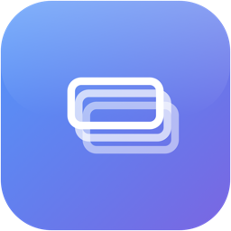

<p align="center">
  
</p>

<h1 align="center">✨ BetterTabbing</h1>

<p align="center">
  <strong>⚡ A fast, keyboard-driven CMD+TAB replacement for macOS with window-level switching and fuzzy search.</strong>
</p>

<p align="center">
  
</p>

---

## 🚀 Features

- 🪟 **Window-level switching** — Switch to specific windows, not just apps
- 🔍 **Fuzzy search** — Type to filter apps and windows instantly
- ⚡ **Quick switch** — Fast CMD+TAB style switching without UI delay
- 💎 **Liquid Glass UI** — Native macOS 26 glass effect
- ⌨️ **Configurable shortcut** — Use ⌥TAB (default) or replace system ⌘TAB

## 📦 Installation

### 💾 Download
Grab the latest release from [Releases](https://github.com/user/BetterTabbing/releases).

### 🔨 Build from source
```bash
git clone https://github.com/user/BetterTabbing.git
cd BetterTabbing
./build-app.sh
```

### 🔐 Permissions
BetterTabbing requires:
- ♿ **Accessibility** — For window management and switching
- ⌨️ **Input Monitoring** — For global keyboard shortcuts

Grant these in **System Settings → Privacy & Security**.

## ⌨️ Usage

| Shortcut | Action |
|----------|--------|
| ⌥TAB | 🎯 Open switcher (or ⌘TAB if configured) |
| TAB | ⬇️ Next app |
| ⇧TAB | ⬆️ Previous app |
| ` | ➡️ Next window in selected app |
| ⇧` | ⬅️ Previous window |
| Return | 🔍 Activate search |
| Escape | ❌ Dismiss |
| Release modifier | ✅ Confirm selection |

## 🏗️ Architecture

```
BetterTabbing/
├── Sources/
│   ├── App/
│   │   ├── BetterTabbingApp.swift    # Entry point, MenuBarExtra
│   │   ├── AppDelegate.swift         # Event handling, window management
│   │   └── AppState.swift            # Observable state
│   │
│   ├── Core/
│   │   ├── EventTap/
│   │   │   ├── KeyboardEventTap.swift    # CGEventTap for global shortcuts
│   │   │   └── ModifierKeyTracker.swift  # Modifier key state
│   │   ├── WindowManagement/
│   │   │   ├── WindowEnumerator.swift    # CGWindowList enumeration
│   │   │   └── WindowCache.swift         # Lock-free caching layer
│   │   ├── Accessibility/
│   │   │   └── AXWindowHelper.swift      # AXUIElement window operations
│   │   └── Permissions/
│   │       └── PermissionManager.swift   # Permission checks
│   │
│   ├── Services/
│   │   ├── WindowSwitcher.swift      # Window activation via AX API
│   │   └── FuzzyMatcher.swift        # Search scoring
│   │
│   ├── Models/
│   │   ├── ApplicationModel.swift    # App representation
│   │   ├── WindowModel.swift         # Window representation
│   │   └── UserPreferences.swift     # Settings persistence
│   │
│   └── UI/
│       ├── SwitcherWindow/
│       │   ├── SwitcherPanel.swift       # NSPanel overlay
│       │   ├── SwitcherView.swift        # Main SwiftUI view
│       │   ├── AppGridView.swift         # App icon grid
│       │   ├── WindowListView.swift      # Window list
│       │   └── SearchResultsListView.swift
│       └── Components/
│           ├── GlassBackground.swift     # macOS glass effect
│           ├── AppTileView.swift         # Individual app tile
│           └── WindowRowView.swift       # Window row
```

### Key Components

**KeyboardEventTap** — Intercepts global keyboard events via `CGEvent.tapCreate()`. Handles modifier tracking, quick-switch detection (< 120ms), and shortcut dispatch.

**WindowCache** — Lock-free read path for UI responsiveness. Background prefetch on activation. In-place reordering after switch for accurate MRU order.

**WindowEnumerator** — Uses `CGWindowListCopyWindowInfo` for fast enumeration, enriched with AXUIElement titles via parallel fetching.

**SwitcherPanel** — `NSPanel` subclass with `.nonactivatingPanel` style. Appears on all spaces, doesn't steal focus during keyboard navigation.

**FuzzyMatcher** — Scores matches by consecutive character bonuses. Returns `SearchResult` objects that can target specific windows.

### Data Flow

```
KeyboardEventTap
      │
      ▼ (Combine PassthroughSubject)
AppDelegate.handleShortcutEvent()
      │
      ├─► WindowCache.prefetchAsync()     (background)
      │
      └─► SwitcherPanel.showWithCachedData()
                │
                ▼
          AppState (ObservableObject)
                │
                ▼
          SwitcherView (SwiftUI)
```

### ⚡ Performance

- ⚡ **< 50ms** window enumeration (parallel AX fetching)
- 🔓 **Lock-free reads** from cache during UI updates
- ⏱️ **120ms quick-switch threshold** — releases before timer = no UI
- 🚀 **Instant hide** — no animations on dismiss

## 📋 Requirements

- 🍎 macOS 26+
- 🦉 Swift 5.9+

## 📄 License

MIT
